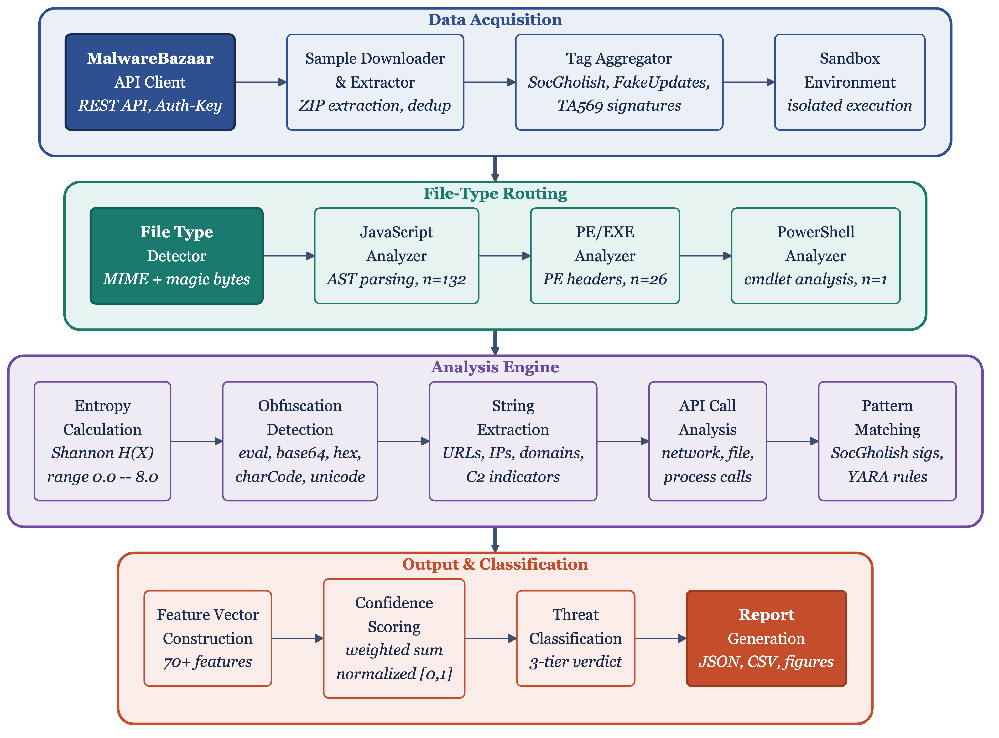
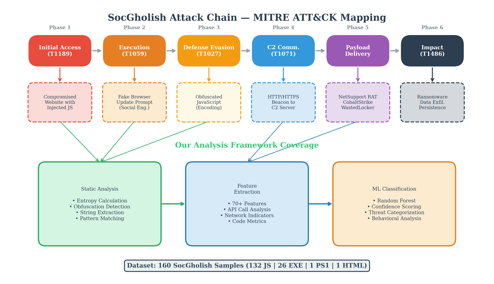
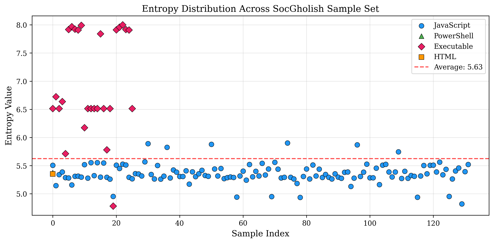
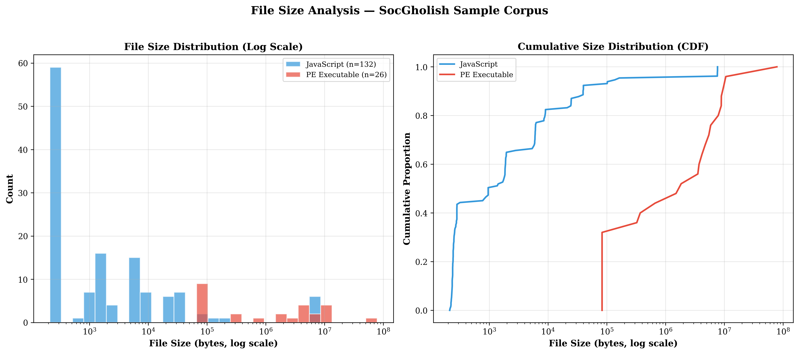
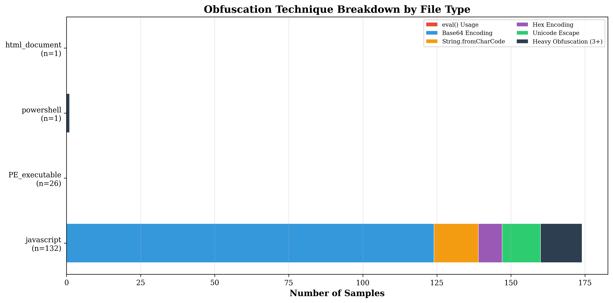
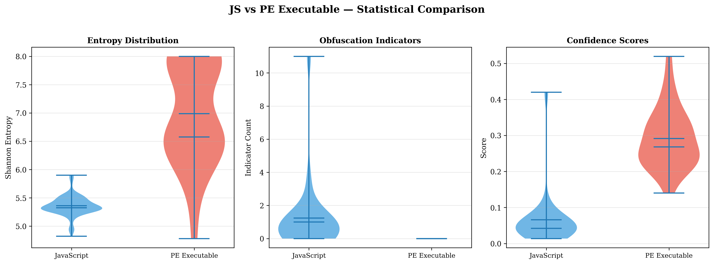
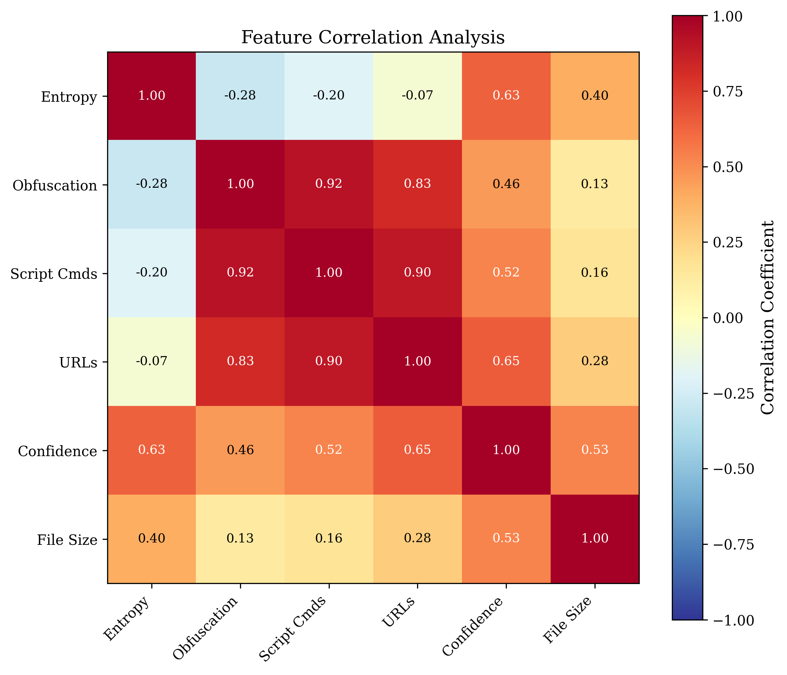
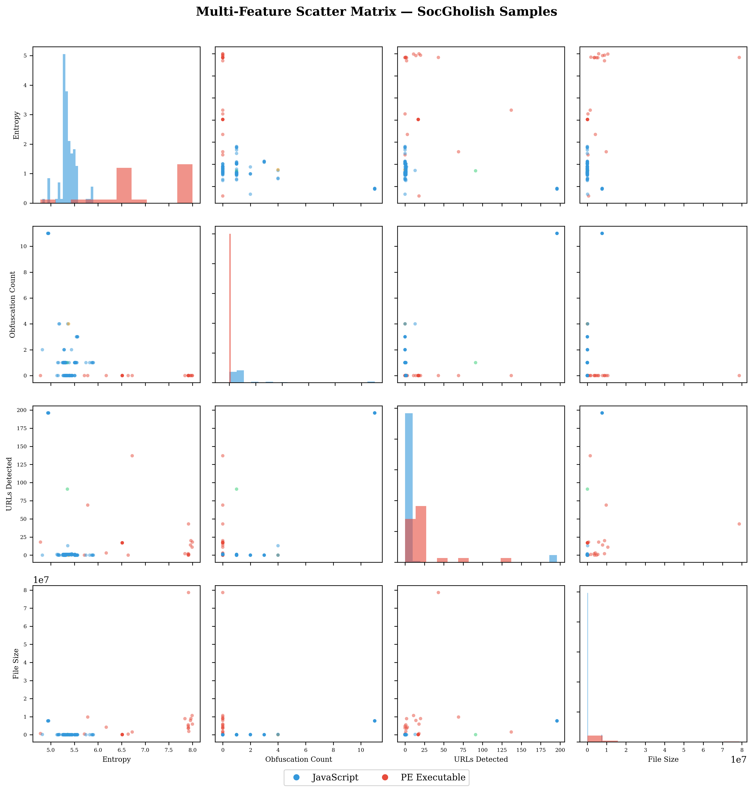

# SocGholish Static Analysis Framework

A systematic static analysis of 160 confirmed SocGholish malware samples collected from MalwareBazaar. This repository accompanies the research paper *"Static Analysis of SocGholish: Entropy Profiling, Obfuscation Detection, and Evasion Characterization"* submitted to Springer Journal of Computer Virology and Hacking Techniques.

---

## Overview

SocGholish is a malware distribution framework active since at least 2018. It compromises legitimate websites and serves fake browser update prompts to deliver malicious payloads. Despite its operational longevity, peer-reviewed static analysis of this family is sparse — most available analysis comes from vendor threat reports covering individual campaigns.

This project provides a Python-based static analysis framework extracting 70+ features per sample, per-sample results for 160 confirmed malicious files across four file types, and reproducible entropy profiling, obfuscation detection, and network artifact extraction.

---

## Dataset

| File Type      | Count | Share  |
|----------------|-------|--------|
| JavaScript     | 132   | 82.5%  |
| PE Executable  | 26    | 16.3%  |
| PowerShell     | 1     | 0.6%   |
| HTML Lure Page | 1     | 0.6%   |
| **Total**      | **160** | —    |

Samples sourced from [MalwareBazaar](https://bazaar.abuse.ch) using the `SocGholish` and `FakeUpdates` tags. Collection window: June 2021 – March 2026. SHA-256 hashes for all 160 samples are in `results/analysis_results.csv`. Samples are not distributed — retrieve via MalwareBazaar using the provided hashes.

---

## Key Findings

| Metric | Value |
|--------|-------|
| Mean entropy — JavaScript | 5.36 (SD = 0.18) |
| Mean entropy — PE Executable | 6.99 (SD = 0.91) |
| PE entropy range | 4.78 – 8.0 |
| Samples with embedded network indicators | 87 (54.4%) |
| Classified suspicious or malicious | 18 (11.3%) |
| Mean obfuscation indicators (JavaScript) | 1.23 |
| Mean confidence score (overall) | 0.104 |

JavaScript loaders cluster tightly at entropy 5.36 (IQR = 0.18) — elevated above unobfuscated code but below packing thresholds. This is a deliberate operational target, not noise. PE payloads reach entropy values up to 8.0, consistent with aggressive packing. The 11.3% detection rate on confirmed malware reflects SocGholish's evasion design, not a limitation of the methodology.

---

## Figures

<table>
<tr>
<td align="center" width="50%">
<br>
<em>Analysis Framework Architecture</em>
</td>
<td align="center" width="50%">
<br>
<em>SocGholish Attack Chain</em>
</td>
</tr>
<tr>
<td align="center" width="50%">
<br>
<em>Entropy Distribution by File Type</em>
</td>
<td align="center" width="50%">
<br>
<em>File Size Distribution</em>
</td>
</tr>
<tr>
<td align="center" width="50%">
<br>
<em>Obfuscation Technique Breakdown</em>
</td>
<td align="center" width="50%">
<br>
<em>Entropy Violin — JavaScript vs PE</em>
</td>
</tr>
<tr>
<td align="center" width="50%">
<br>
<em>Feature Correlation Heatmap</em>
</td>
<td align="center" width="50%">
<br>
<em>Feature Scatter Matrix</em>
</td>
</tr>
</table>

---

## Repository Structure

```
socgholish-analysis/
├── analysis/
│   ├── socgholish_analyzer.py          # Core analysis framework (70+ features per sample)
│   ├── generate_advanced_figures.py    # Statistical figure generation
│   ├── generate_visualizations.py      # Visualization pipeline
│   ├── download_samples.py             # MalwareBazaar sample collector
│   └── download_all_socgholish.py      # Bulk SocGholish/FakeUpdates downloader
├── figures/                            # All figures as used in the paper (PNG)
├── results/
│   ├── analysis_results.csv            # Per-sample feature matrix (160 rows × 70+ columns)
│   ├── analysis_results.json           # Full results in JSON format
│   └── analysis_summary.json           # Aggregate statistics
└── paper/
    ├── main.tex                        # LaTeX source (Springer sn-jnl format)
    └── sn-bibliography.bib             # Bibliography
```

---

## Feature Extraction

The core analyzer (`analysis/socgholish_analyzer.py`) extracts 70+ features per sample across six categories:

| Category | Feature | Description |
|----------|---------|-------------|
| **Entropy** | Shannon entropy | Byte-level entropy of the full file |
| **Entropy** | Per-section entropy | Entropy per PE section (.text, .data, .rdata, etc.) |
| **Entropy** | Average section entropy | Mean across all sections |
| **Entropy** | Entropy ratio | Normalized entropy (entropy / log2(256)) |
| **Obfuscation** | base64 strings | Count of base64-encoded string literals |
| **Obfuscation** | eval() count | Number of eval() invocations |
| **Obfuscation** | fromCharCode | Usage of String.fromCharCode encoding |
| **Obfuscation** | Unicode escapes | Count of \uXXXX escape sequences |
| **Obfuscation** | Hex strings | Hex-encoded string literals |
| **Obfuscation** | String concatenation | Fragmented string assembly patterns |
| **Network** | Embedded URLs | Regex-extracted URL strings |
| **Network** | IP addresses | IPv4 address strings |
| **Network** | Domain names | Extracted domain references |
| **Network** | C2 patterns | Known C2 URL structure matching |
| **Behavioral** | API calls | Classified by type: process, file, registry, network, persistence, crypto |
| **Behavioral** | PowerShell cmdlets | Detected cmdlet invocations |
| **Behavioral** | WMI usage | Windows Management Instrumentation indicators |
| **Behavioral** | Scheduled tasks | Task registration references |
| **Behavioral** | Download cradles | PowerShell/JS download-and-execute patterns |
| **Metadata** | File size | Byte count (and character count for scripts) |
| **Metadata** | File type | javascript / PE_executable / powershell / html_document |
| **Metadata** | Hashes | MD5, SHA1, SHA256 |
| **Metadata** | Modification timestamp | File last-modified datetime |
| **Classification** | Confidence score | Weighted heuristic score (0.0 – 1.0) |
| **Classification** | Suspicious threshold | Score >= 0.3 |
| **Classification** | Malicious threshold | Score >= 0.7 |

---

## Usage

### Requirements

```bash
pip install pefile python-magic requests tqdm pandas matplotlib seaborn scipy
```

### Run analysis on a directory of samples

```bash
python analysis/socgholish_analyzer.py --input /path/to/samples --output results/
```

### Reproduce figures from existing results

```bash
python analysis/generate_advanced_figures.py --results results/analysis_results.csv --output figures/
python analysis/generate_visualizations.py --results results/analysis_results.csv --output figures/
```

### Collect samples from MalwareBazaar

```bash
python analysis/download_all_socgholish.py --tag SocGholish --output samples/
```

Requires a MalwareBazaar API key set as an environment variable:
```bash
export MALBAZAAR_API_KEY=your_key_here
```

---

## Results Data

`results/analysis_results.csv` contains one row per sample with 70+ columns including:

| Column | Description |
|--------|-------------|
| `sha256` | Sample identifier (use to pull from MalwareBazaar) |
| `file_type` | javascript / PE_executable / powershell / html_document |
| `entropy` | Shannon entropy of the full file |
| `obfuscation_indicators_count` | Number of obfuscation technique hits |
| `urls_count` | Number of embedded URL strings |
| `confidence_score` | Classification confidence (0 – 1) |
| `classification` | benign / suspicious / malicious |
| `is_likely_malware` | Boolean flag from heuristic engine |
| `ml_features` | JSON blob of all numeric features used in classification |

---

## Ethical Note

All samples analyzed here are publicly available through MalwareBazaar. No samples are distributed in this repository. SHA-256 hashes are provided for reproducibility; researchers can retrieve samples independently through MalwareBazaar's API with an approved account. This work is conducted for defensive research purposes.

---

## Citation

Citation details will be added upon publication.

---

## License

MIT License. The analysis framework code is freely reusable. Sample hashes and extracted features are provided for research use.
