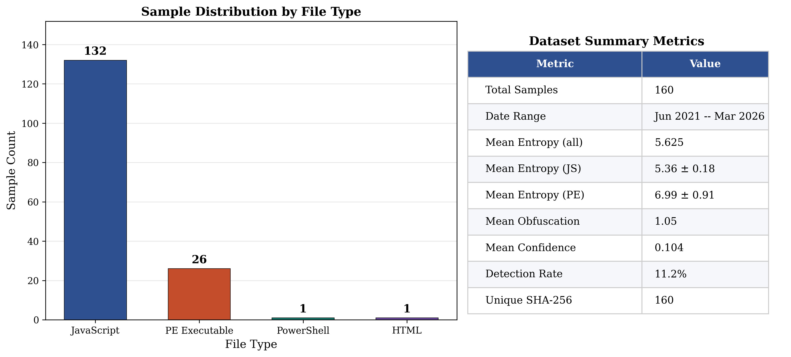
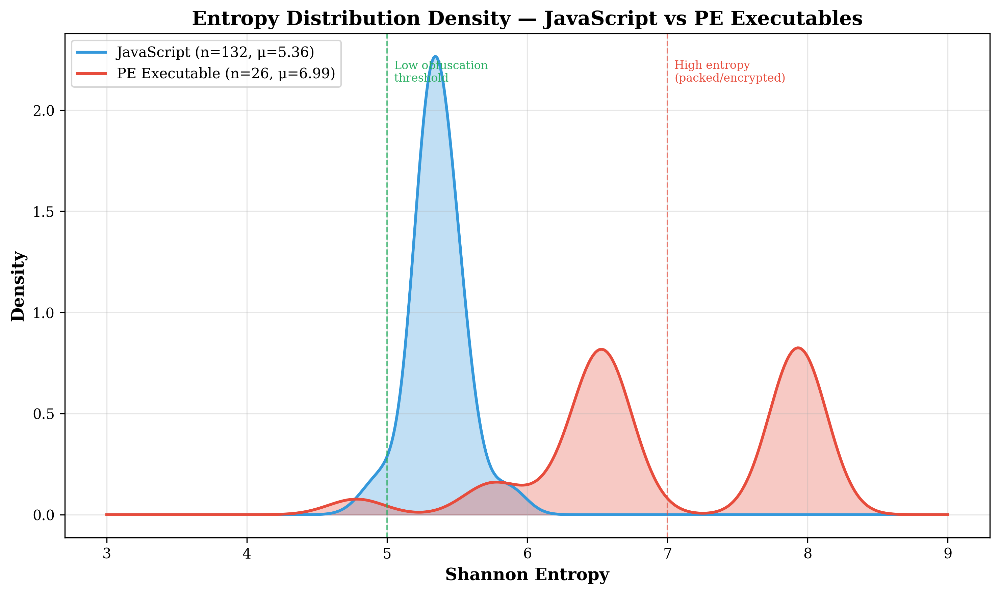
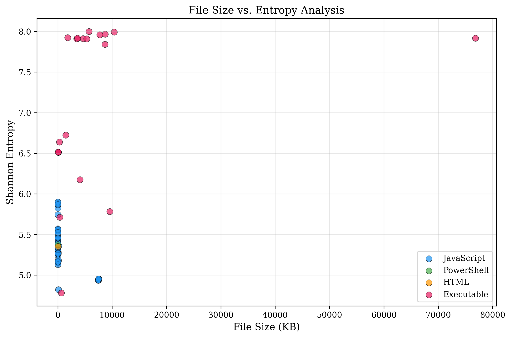
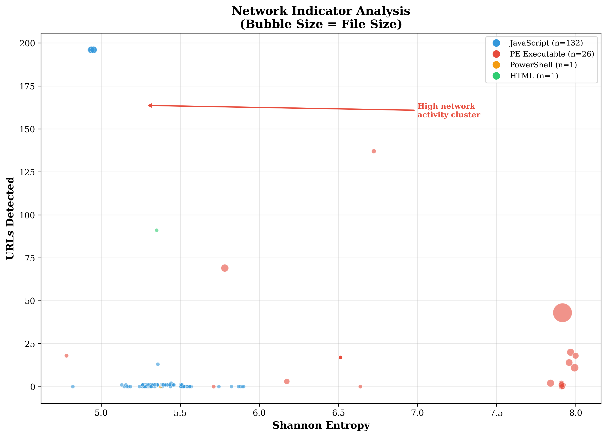
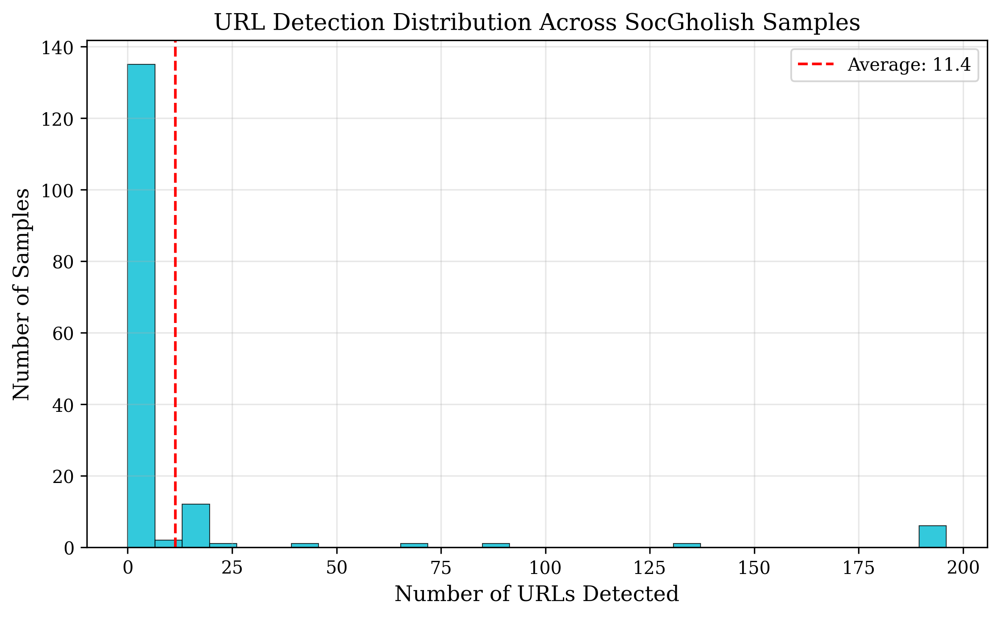
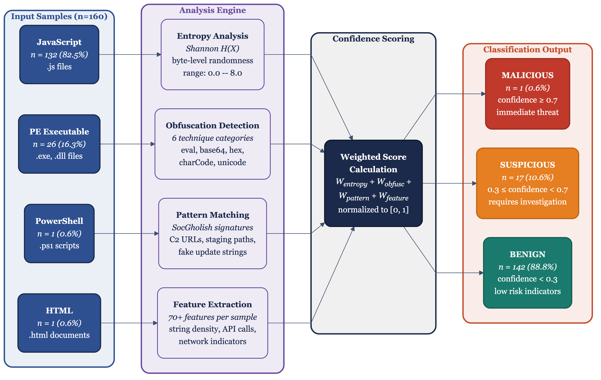
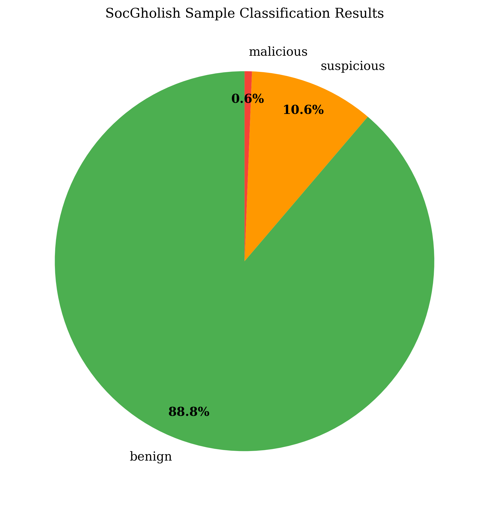
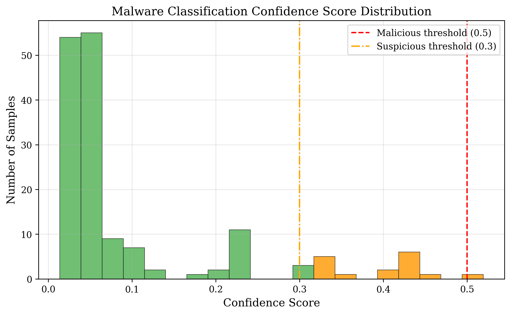
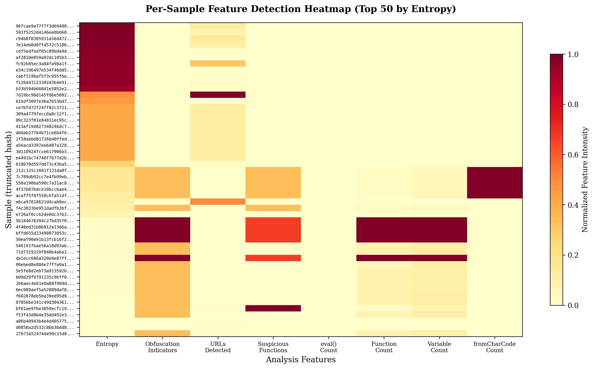
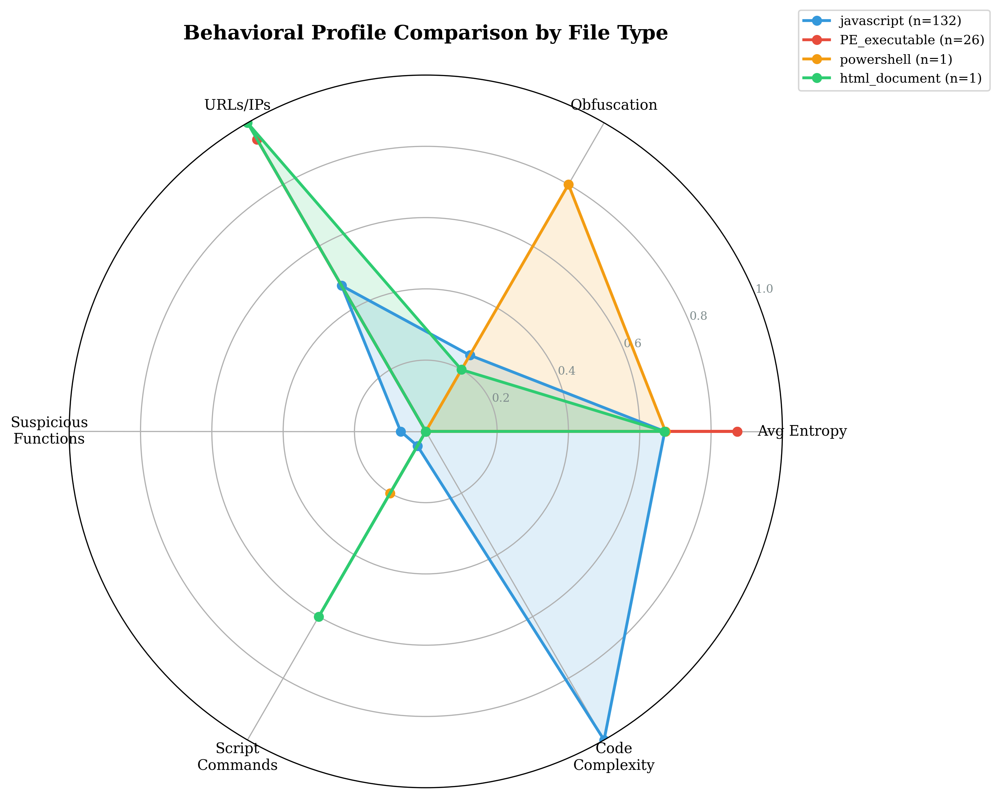

# SocGholish Static Analysis Framework

A systematic static analysis of 160 confirmed SocGholish malware samples collected from MalwareBazaar. This repository accompanies the research paper *"Static Analysis of SocGholish: Entropy Profiling, Obfuscation Detection, and Evasion Characterization"* submitted to Springer Journal of Computer Virology and Hacking Techniques.

---

## Overview

SocGholish is a malware distribution framework active since at least 2018. It compromises legitimate websites and serves fake browser update prompts to deliver malicious payloads. Despite its operational longevity, peer-reviewed static analysis of this family is sparse — most available analysis comes from vendor threat reports covering individual campaigns.

This project provides:
- A Python-based static analysis framework extracting 70+ features per sample
- Per-sample results for 160 confirmed malicious files across four file types
- Reproducible entropy profiling, obfuscation detection, and network artifact extraction
- Figures generated directly from extracted data, as used in the paper

---

## Dataset

| File Type      | Count | Share  |
|----------------|-------|--------|
| JavaScript     | 132   | 82.5%  |
| PE Executable  | 26    | 16.3%  |
| PowerShell     | 1     | 0.6%   |
| HTML Lure Page | 1     | 0.6%   |
| **Total**      | **160** | —    |

Samples sourced from [MalwareBazaar](https://bazaar.abuse.ch) using the `SocGholish` and `FakeUpdates` tags. Collection window: June 2021 – March 2026.

SHA-256 hashes for all 160 samples are included in `results/analysis_results.csv` (column: `sha256`). Samples themselves are not distributed — download via MalwareBazaar using the provided hashes.

---

## Key Findings

| Metric | Value |
|--------|-------|
| Mean entropy (JavaScript) | 5.36 (SD = 0.18) |
| Mean entropy (PE) | 6.99 (SD = 0.91) |
| PE entropy range | 4.78 – 8.0 |
| Samples with embedded network indicators | 87 (54.4%) |
| Classified suspicious or malicious | 18 (11.3%) |
| Mean obfuscation indicators (JavaScript) | 1.23 |
| Mean confidence score (overall) | 0.104 |

JavaScript loaders cluster tightly at entropy 5.36 (IQR = 0.18) — elevated above unobfuscated code but below packing thresholds. This is a deliberate operational target, not noise. PE payloads reach entropy values up to 8.0, consistent with aggressive packing. The 11.3% detection rate on confirmed malware reflects SocGholish's evasion design, not a limitation of the methodology.

---

## Figures

### Attack Chain


### Framework Architecture


### File Type Distribution


### Entropy Distribution by File Type


### Entropy KDE — JavaScript vs PE


### Entropy vs File Size


### File Size Distribution


### Obfuscation Technique Breakdown


### Network Indicator Distribution


### URL Distribution


### Classification Flow


### Classification Summary


### Confidence Score Distribution


### Detection Heatmap


### Violin Comparison (JavaScript vs PE)


### Feature Correlation Heatmap


### Scatter Matrix


### Radar Comparison


---

## Repository Structure

```
socgholish-analysis/
├── analysis/
│   ├── socgholish_analyzer.py          # Core analysis framework (70+ features per sample)
│   ├── generate_advanced_figures.py    # Statistical figure generation
│   ├── generate_visualizations.py      # Visualization pipeline
│   ├── download_samples.py             # MalwareBazaar sample collector
│   └── download_all_socgholish.py      # Bulk SocGholish/FakeUpdates downloader
├── figures/                            # All figures as used in the paper (PNG)
├── results/
│   ├── analysis_results.csv            # Per-sample feature matrix (160 rows × 70+ columns)
│   ├── analysis_results.json           # Full results in JSON format
│   └── analysis_summary.json           # Aggregate statistics
└── paper/
    ├── main.tex                        # LaTeX source (Springer sn-jnl format)
    └── sn-bibliography.bib             # Bibliography
```

---

## Feature Extraction

The core analyzer (`analysis/socgholish_analyzer.py`) extracts the following feature categories per sample:

**Entropy features**
- Shannon entropy (byte-level)
- Per-section entropy (PE files)
- Average section entropy
- Entropy ratio (normalized)

**Obfuscation indicators**
- base64 string detection
- `eval()` usage count
- `fromCharCode` usage
- Unicode escape sequences
- Hex string encoding
- String concatenation patterns

**Network artifacts**
- Embedded URLs (regex extraction)
- IP address strings
- Domain names
- C2-pattern matching

**Behavioral patterns**
- API call classification (process, file, registry, network, persistence, crypto)
- PowerShell cmdlet detection
- WMI usage indicators
- Scheduled task references
- Download cradle patterns

**File metadata**
- File size (bytes and character count for scripts)
- File type classification
- MD5, SHA1, SHA256 hashes
- Modification timestamp

**Classification output**
- Confidence score (0.0 – 1.0)
- Suspicious threshold: 0.3
- Malicious threshold: 0.7

---

## Usage

### Requirements

```bash
pip install pefile python-magic requests tqdm pandas matplotlib seaborn scipy
```

### Run analysis on a directory of samples

```bash
python analysis/socgholish_analyzer.py --input /path/to/samples --output results/
```

### Reproduce figures from existing results

```bash
python analysis/generate_advanced_figures.py --results results/analysis_results.csv --output figures/
python analysis/generate_visualizations.py --results results/analysis_results.csv --output figures/
```

### Collect samples from MalwareBazaar

```bash
python analysis/download_all_socgholish.py --tag SocGholish --output samples/
```

Requires a MalwareBazaar API key. Set via environment variable:
```bash
export MALBAZAAR_API_KEY=your_key_here
```

---

## Results Data

`results/analysis_results.csv` contains one row per sample with 70+ columns including:

| Column | Description |
|--------|-------------|
| `sha256` | Sample identifier (use to pull from MalwareBazaar) |
| `file_type` | javascript / PE_executable / powershell / html_document |
| `entropy` | Shannon entropy of the full file |
| `obfuscation_indicators_count` | Number of obfuscation technique hits |
| `urls_count` | Number of embedded URL strings |
| `confidence_score` | Classification confidence (0–1) |
| `classification` | benign / suspicious / malicious |
| `is_likely_malware` | Boolean flag from heuristic engine |
| `ml_features` | JSON blob of all numeric features used in classification |

---

## Ethical Note

All samples analyzed here are publicly available through MalwareBazaar. No samples are distributed in this repository. SHA-256 hashes are provided for reproducibility; researchers can retrieve samples independently through MalwareBazaar's API with an approved account.

This work is conducted for defensive research purposes: understanding SocGholish's static characteristics supports detection engineering and threat intelligence.

---

## Citation

If you use this framework or dataset in your research, please cite the accompanying paper (citation details will be added upon publication).

---

## License

MIT License. The analysis framework code is freely reusable. Sample hashes and extracted features are provided for research use.
